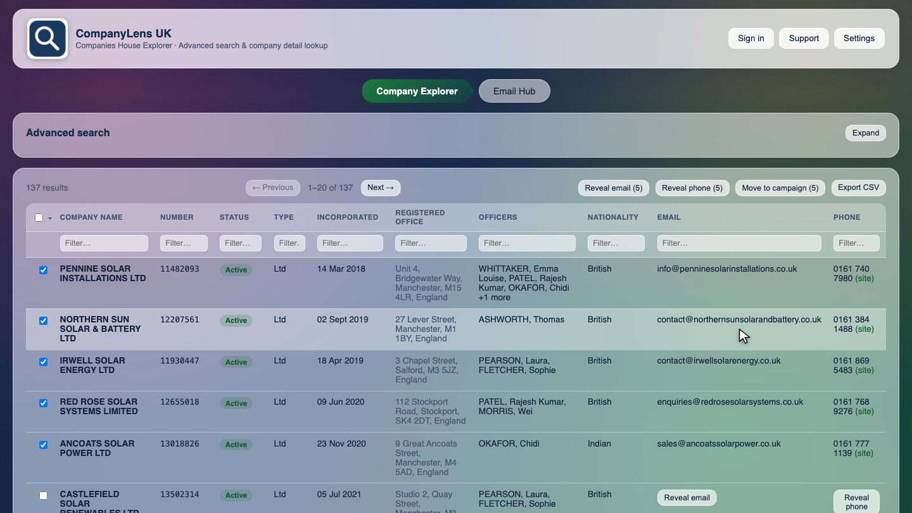
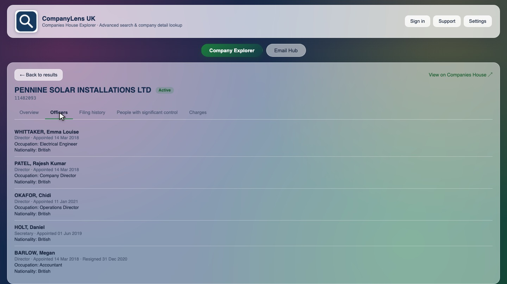
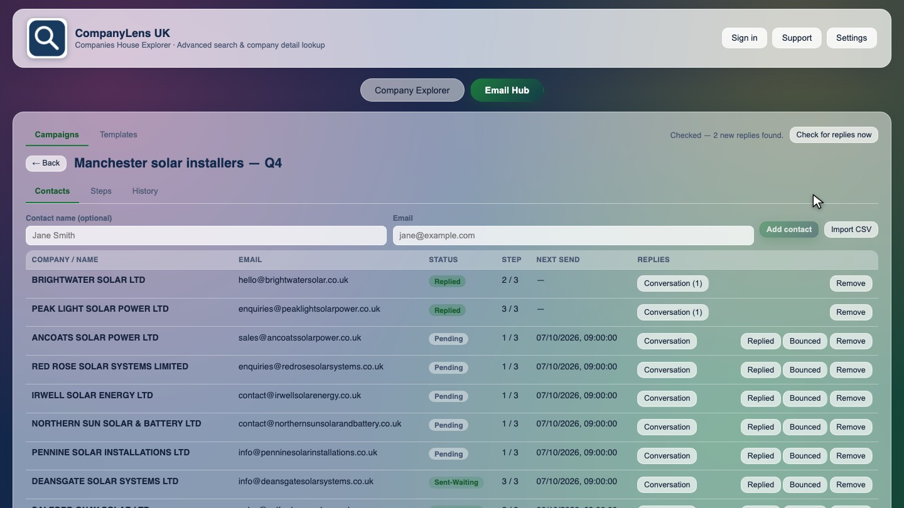
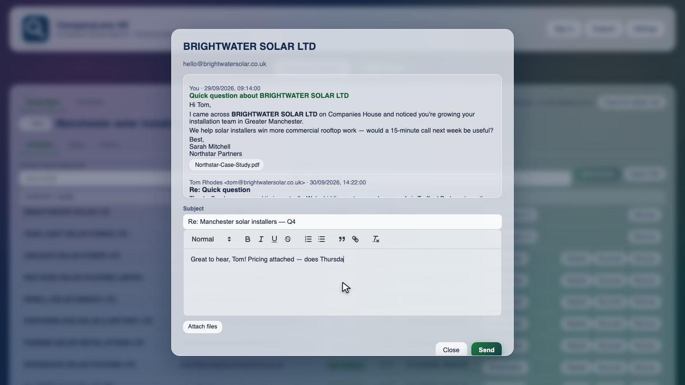

# CompanyLens UK

**Find, qualify and reach UK companies from one screen.**

CompanyLens UK is a desktop app for Mac and Windows that brings together three jobs:
- searching the Companies House register;
- finding contact details for the companies you find;
- running email outreach to them.

Build a targeted list of companies, check each one's officers, filings and ownership, find a phone number and email for it, and send it a multi-step email campaign, all without leaving the app.

Screenshots show sample data for illustration.

## Download

Get the latest installers from the **[Releases page](https://github.com/hksahni0-ux/companylens-uk-releases/releases/latest)**.

| Your computer | File to download |
|---|---|
| Mac with Apple Silicon (M1 and later) | `CompanyLens-UK-<version>-arm64.dmg` |
| Mac with an Intel processor | `CompanyLens-UK-<version>.dmg` |
| Windows: installs the app | `CompanyLens-UK-Setup-<version>.exe` |
| Windows: runs without installing (portable) | `CompanyLens-UK-<version>.exe` |

You can ignore the `.blockmap` and `latest*.yml` files. The app uses them to check for updates.

### First launch

The installers aren't code-signed yet, so your computer will warn you the first time you open the app:

- **macOS:** open the `.dmg` and drag CompanyLens UK into **Applications**. If macOS says the app is from an unidentified developer, **right-click** the app, choose **Open**, then confirm.
- **Windows:** if SmartScreen shows "Windows protected your PC", click **More info**, then **Run anyway**.

## Getting started

1. **Activate your license.** Paste the license key you received into the activation screen and click **Activate**. If you don't have a key yet, click **Get started** on the same screen.
2. **Add a Companies House API key (required, free).** Register at the [Companies House developer hub](https://developer.company-information.service.gov.uk/get-started), create a REST API key, and paste it into **Settings**.
3. **Add a Google Places API key (optional).** This turns on the phone and email lookups. See [Phone & email lookup](#phone--email-lookup) below.
4. **Set up your mailbox (optional).** To send campaigns from the Email Hub, add your mailbox's SMTP details in **Settings**. Add its IMAP details too if you want replies detected automatically. Use **Send test email** to check it works.
5. **Add your branding (optional).** Upload your logo and set your company name under **Settings → Your branding**.

A short guided tour runs the first time you open the app, and a "what's new" tour appears after updates that add features.

## Features

### Company search and intelligence
- Every Companies House advanced-search filter: company name (includes and excludes), registered office location, SIC codes, company status, company type, and incorporation and dissolution date ranges, with a choice of sort order.
- A results table with a live filter on every column, including officer names and nationality, which are pulled in automatically for each row.
- Select single rows, everything on the current page, or every result across all pages.
- Export the current view to CSV in one click.
- A full profile for each company: overview, officers, filing history, people with significant control (PSC) and charges. Each profile links to the official Companies House record.

### Phone & email lookup
- Reveal a phone number and email for each company, one row at a time or in bulk across selected rows.
- The app finds the company's Google Business listing to get a phone number and website, then checks that website's contact pages for an email address.
- Every result is saved on your machine, so you never pay to look up the same company twice.
- These lookups are best-effort. Treat them as leads to verify, not as confirmed contact details.

### Email Hub
- Move contacts with a revealed email straight from your search results into a campaign, or import them from a CSV file.
- Multi-step sequences: pick a template and a delay for each follow-up.
- Rich-text templates with attachments and merge fields such as `{{company_name}}` and `{{contact_name}}`.
- Replies are detected automatically through IMAP, or you can click **Check for replies now** to check straight away. Campaigns and contacts with replies move to the top.
- A full conversation view for each contact, where you can reply, with attachments, without leaving the app.

### Teams, sync and account portal (all optional)
- Sign in with Google or a one-time email code. The app works fully without signing in.
- Once you sign in, campaigns, contacts and templates sync across every device on your license.
- Invite colleagues onto your license with a shareable link. There are no separate seats to buy.
- The **[account portal](https://companylens-licensing.hksahni0.workers.dev/portal)** shows your license status and expiry date, lists your activated devices so you can revoke one to free its slot, and lets you renew.

### White-label branding
Your company name and logo replace the CompanyLens UK branding in the app header, so the app looks like a tool your team built.

## Licensing

- Each license covers **3, 7 or 10 devices**, chosen when you buy.
- Licenses run for a term of 1, 3, 6 or 12 months. Longer terms cost less per month. New customers start with a 6-month term.
- You pay by bank transfer, and your key is issued once payment is confirmed, usually within one business day. Current prices and payment details are on the **[license page](https://companylens-licensing.hksahni0.workers.dev/)**.
- Every license includes up to 10 campaigns and 100,000 contacts across all campaigns.
- The app shows a **Renew** banner shortly before your license expires.

## Updates

The app tells you when a new version is available. You choose when to install it with **Update now**, or click **Skip**, so an update never interrupts your work.

## Your data

- Your searches, contacts, campaigns and settings are stored on your own machine.
- API keys are stored encrypted, using your operating system's keychain where it's available.
- The app only sends data to:
  - the official Companies House API;
  - the Google Places API, if you add a Places key;
  - your own mailbox, if you set up email;
  - the sync service, but only if you choose to sign in.

## Support

Email **[hksahni0@gmail.com](mailto:hksahni0@gmail.com?subject=CompanyLens%20UK%20support)**, or use **Support** in the app header. You can also ask for a live demo using a search that's relevant to your industry.

---

CompanyLens UK uses the Companies House public data API. It is not affiliated with or endorsed by Companies House. Built by [Prateek Sahni](https://prateeksahni.pages.dev/).
